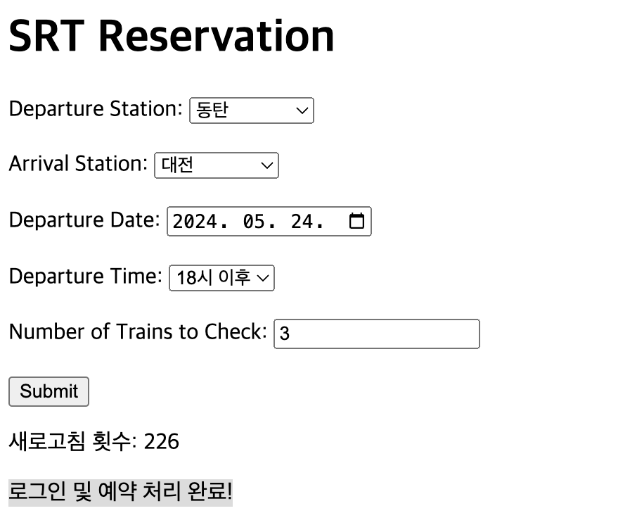

# SRT MACRO

원하는 기차표 시간이 예약이 풀릴 때까지 시도하여 예매를 도와주는 프로그램
`flask` 를 이용하여 웹으로 실시간 현황을 확인 가능하다.


## 사용방법

__chromedriver 설치__
(설치된 chrome version 확인 후 설치)
- 버전 확인 방법 : 점세개 아이콘 클릭 후 도움말 > Chrome 정보
https://developer.chrome.com/docs/chromedriver/downloads?hl=ko

#### chrome 바이너리 차단 시 
```angular2html
xattr -d com.apple.quarantine /Chrome driver 경로 /chromedriver
```

#### chrome driver 경로 설정
```
driver_path='절대경로'
```

#### python start
```angular2html
python app.py
```

#### 비밀번호 회원번호 수정


**실행 결과**




### 출처
https://github.com/kminito/srt_reservation